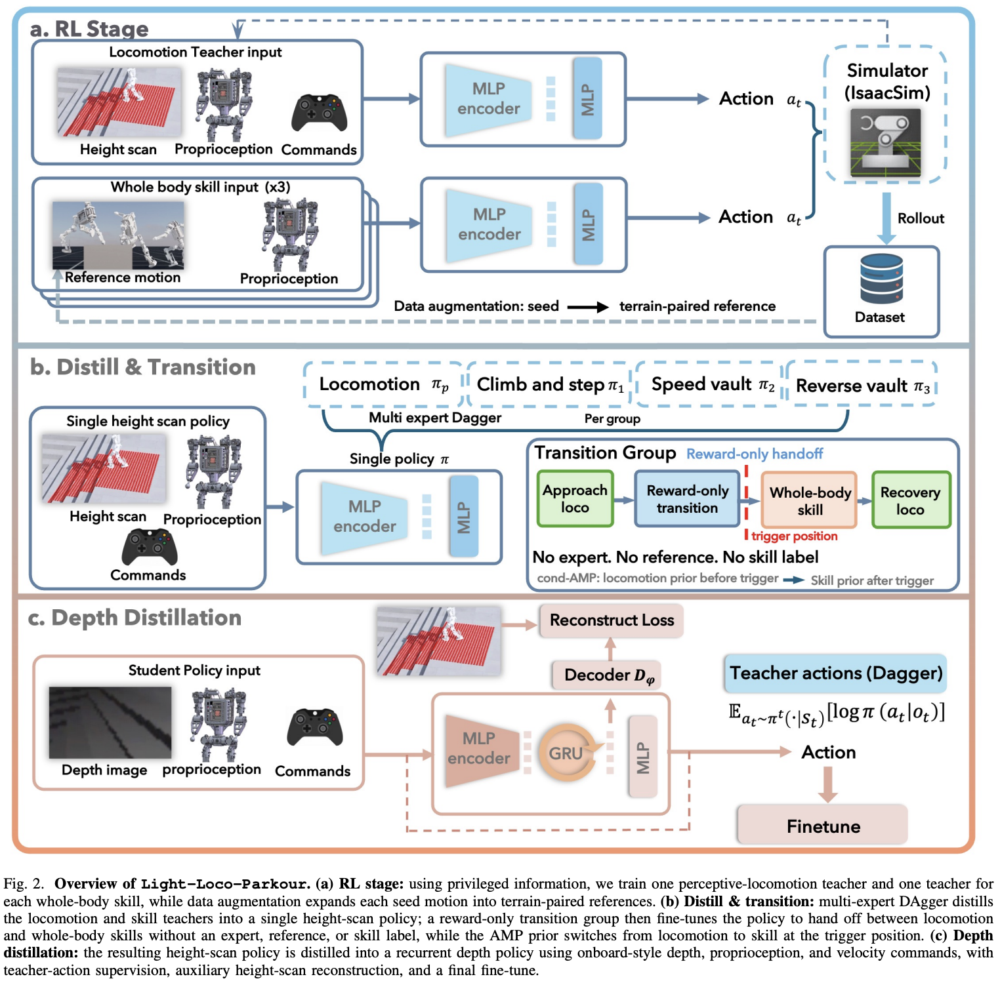

</img>

## Light Loco Parkour - (wip)

Implementation of [Light Loco Parkour](https://light-loco-parkour.github.io/), Versatile Perceptive Whole-Body Locomotion via Multi-Skill Distillation, out of Light Origins Labs

## Citations

```bibtex
@misc{chen2026lightlocoparkour,
    title   = {Light-Loco-Parkour: Versatile Perceptive Whole-Body Locomotion via Multi-Skill Distillation},
    author  = {Hongming Chen and Zhuoran Li and Hongxi Wang and Jiangpeng Hu and Ziliang Li and Peize Liu and QingRui Zhao and Xuhao Liu and Liang Pan and Ximin Lyu and Yuntao Ma and Tingxiang Fan},
    year    = {2026},
    url     = {https://light-loco-parkour.github.io/}
}
```

```bibtex
@article{zhao2025knowledge,
    author  = {Zhao, Rui and Fan, Yuze and Li, Yun and Zhang, Dong and Gao, Fei and Gao, Zhenhai and Yang, Zhengcai},
    title   = {Knowledge Distillation-Enhanced Behavior Transformer for Decision-Making of Autonomous Driving},
    journal = {Sensors},
    year    = {2025},
    volume  = {25},
    number  = {1},
    pages   = {191},
    doi     = {10.3390/s25010191},
    url     = {https://www.mdpi.com/1424-8220/25/1/191}
}
```

```bibtex
@inproceedings{Huang2025TheGI,
    title   = {The GAN is dead; long live the GAN! A Modern GAN Baseline},
    author  = {Yiwen Huang and Aaron Gokaslan and Volodymyr Kuleshov and James Tompkin},
    year    = {2025},
    url     = {https://api.semanticscholar.org/CorpusID:275405495}
}
```
